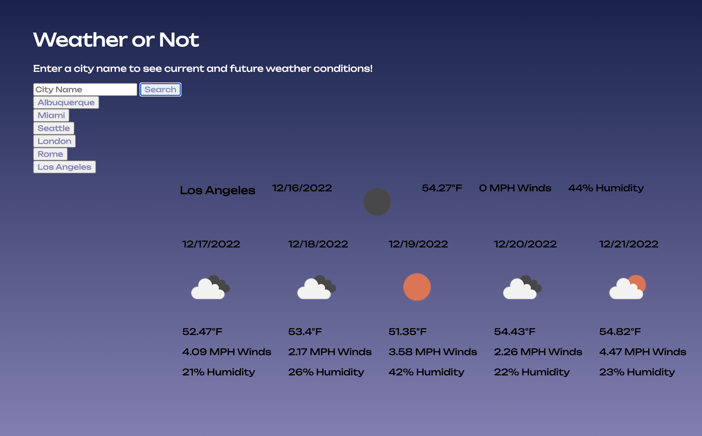

# Weather or Not

## [Deployed Application](https://amaryahwolf.github.io/weather-dashboard/)

## Description
This application is a weather dashboard that displays the current weather for any city around the world, as well as the 5-day forecast. This application uses HTML, CSS and Open Weather API dynamically powered by JavaScript.

## Table of Contents
- [Installation](#installation)
- [Usage](#usage)
- [Credits](#credits)
- [License](#license)
- [Contributing](#contributing)
- [Tests](#tests)
- [Questions](#questions)

## Installation
To run the application, simply enter the URL in any browser.  
To install the application locally, clone the repository locally then open the index.html file in any browser.

## Usage
To use this application, enter the name of a city in the search bar. The application will populate with the city's current weather and 5-day forecast. The city will save as a button below the search bar, which can be selected again to re-generate the data.

## Credits
Collaborators: Amaryah Wolf

## License
This application is covered under the MIT license.

## Contributing
[Contributor Covenant](https://www.contributor-covenant.org/version/2/1/code_of_conduct/)

## Tests
N/A

## Questions
For additional questions, find me on [github](https://github.com/amaryahwolf) or email me at amaryahwolf@gmail.com